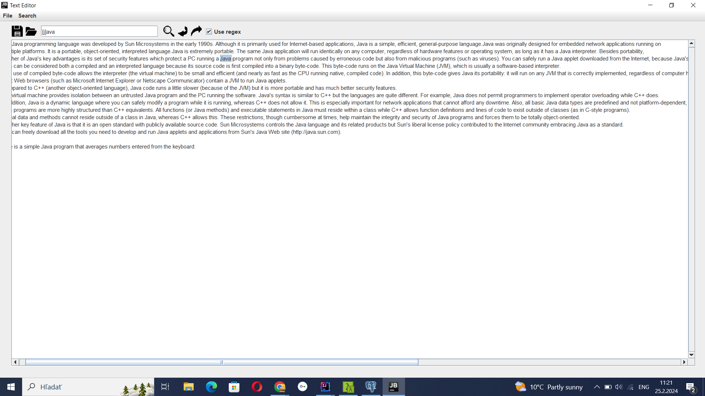

# TEXT EDITOR

This text editor with a GUI has several useful features.

 ## Components and their functions:

 

## SAVE button 
> You can save any .txt file to a specific folder using the fileChooser. 
You can click on the icon above the text area or go through File -> Save on the main bar.

## LOAD button 
> You can load any .txt file from a specific folder using the fileChooser. 
You can click on the icon above the text area or go through File -> Load on the main bar.

## Search button 
> When you write a word in the text field above the text area and press this button,
the program will find all the matches with this word in the text area and mark the first match.

## Next match 
> If you press this button, you can iterate through all word matches in the text area.

## Previous search 
> You can jump back to the previous word match that the program found.

## Use regex checkbox 
> When you check this checkbox, you can use regexes in the search.

**How to Run the Project**

1. **Clone the Project**: Use Git to clone the project repository (`git clone https://github.com/OwnStyle777/textEditor.git`).

2. **Download ZIP File**: Alternatively, you can download the project as a ZIP file and extract it to a designated folder on your local machine.

3. **Open Project in IDE**: After cloning or extracting, open the project folder in your preferred Integrated Development Environment (IDE), such as IntelliJ IDEA.

4. **Select JDK**: Set the path to the Java Development Kit (JDK) in the project settings of your IDE.

5. **Run the Main Method**: Locate the **ApplicationRunner** class and run the main method ,using your IDE.

*GUI = Graphical User Interface

Author: Martin Haronik, project idea from Hyperskill.
